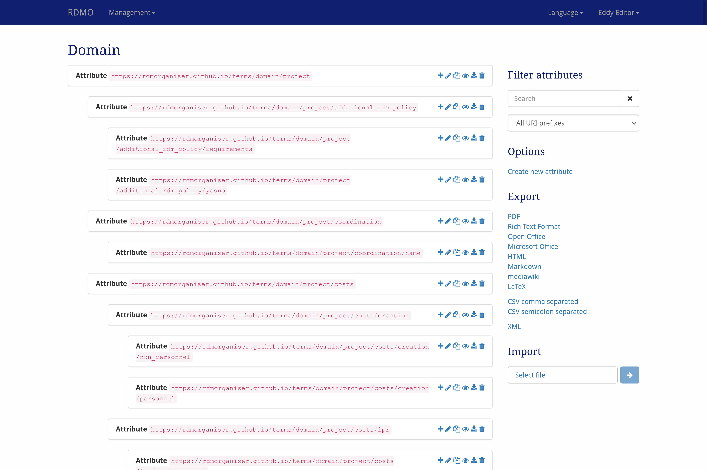

# Domain

The domain model can be managed under *Domain* in the management menu in the navigation bar.

After the installation of RDMO the domain is initially empty. **We suggest that all RDMO operators initially import the domain model provided by the RDMO project.** Using a common domain over all RDMO instances allows us to exchange questionnaires, views and other content, and could lead to a common metadata application profile for data management planning. Our domain is available at https://github.com/rdmorganiser/rdmo-catalog. The domain is meant to be extendable, but the core data model enables interoperability and cooperativity amongst RDMO instances and it is a good starting point to create questionnaires.

> *Screenshot of the domain management interface*

On the left-hand side is the main display of all the attributes available in this installation of RDMO. On the right side of each elements panel, icons indicate ways to interact the element. The following options are available:

* **Add** () a new attribute.
* **Update** () an attribute to change its properties.
* **Copy** () an attribute. This will open a modal to set a new key.
* **Show** () the references from, e.g. questions, to an attribute. This will open a modal.
* **Export** () an attribute and all of its decendants as XML.
* **Delete** () an attribute and all of it's decendants. **The action will remove the attribute and all the attributes below. This action cannot be undone!**

The sidebar on the right-hand side shows additional interface items:

* **Filter** filters the view according to a user given string or a given URI prefix.
* **Options** offers additional operations:
  * Create a new (empty) attribute
* **Export** exports the current catalog to one of the displayed formats. While the textual formats are mainly for presentation purposes, the XML export can be used to transfer the domain model to a different installation of RDMO.

The different elements of the domain model have different properties to control their behavior. As described in [the introduction](index.html), all elements have an URI prefix, a key, and an internal comment only to be seen by other managers of the RDMO installation. In addition, you can edit the parameters below:

## Parameters

|Name|Explanation|
|-|-|
|Parent attribute|Indicates the parent attribute in the domain model|

## Attributes, entities, and the data model refactoring

Prior to version [0.11.0](https://github.com/rdmorganiser/rdmo/releases/tag/0.11.0) (released in December 2018), the domain model distinguished between `Entities` as inner nodes and `Attributes` as leafs of the tree structure.
Due to the data model refactoring in 0.11.0, this is no longer the case and all entries in the domain are `Attributes`.
Note that in older publications on RDMO's domain model you might still find this nomenclature.
