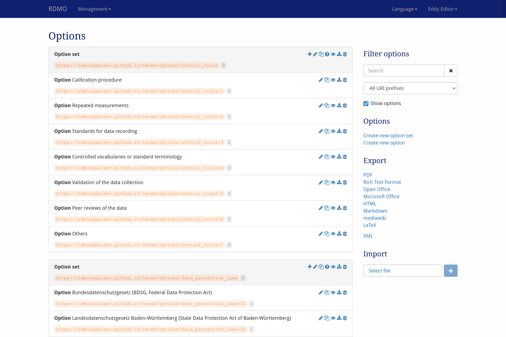

# Options

Options and option sets can be managed under *Options* in the management menu in the navigation bar.

> *Screenshot of the options management interface*

On the left-hand side is the main display of all the option sets and options available in this installation of RDMO. Option sets show their key, while options show their path and their text. On the right side of each elements panel, icons indicate ways to interact the element. The following options are available:

* **Add** () a new option to an option set.
* **Update** () an option set or option to change its properties.
* **Copy** () an option set or option. This will open a modal to set a new key.
* **Update conditions** () of an option set. A question connected to an option set with one or more conditions, will not show the options of the set in the questionnaire, if the condition is evaluated to be false. The conditions themselves are configured in [the conditions management](../management/conditions.html).
* **Export** () an option set (incl. options) or a single option as XML.
* **Delete** () an option set or option and, in the case of an option set, all of its options. **This action cannot be undone!**

The sidebar on the right shows additional interface items:

* **Filter** filters the view according to a user given string or a given URI prefix.
* **Options** offers additional operations:
  * Create a new (empty) option set
  * Create a new (empty) option
* **Export** exports the options sets to one of the displayed formats. While the textual formats are mainly for presentation purposes, the XML export can be used to transfer the options sets to a different installation of RDMO.

Option sets and options model have different properties to control their behavior. As described in [the introduction](index.html), all elements have an URI prefix, a key, and an internal comment only to be seen by other managers of the RDMO installation. In addition, you can edit the parameters below:

## Parameters
### Option set

|Name|Explanation|
|-|-|
|Order|Controls the position of the option set in lists or in the interview (if an attribute has more than one option set)|

### Option

|Name|Explanation|
|-|-|
|Option set|The option set this option belongs to. Changing the option set will move the option to a different option set
|Order|Controls the position of the option in lists or in the interview
|Text|The text for the option to be displayed to the user
|Additional input|Designates whether an additional input is possible for this option. In this case a text box is displayed to the radio button or check box. Usually this is used for an option "Other".
|Provider|The provider plugin for this questionset. If set, it will create dynamic options for this optionset. Optionset providers are described [here](../configuration/plugins.html#optionset-providers).
