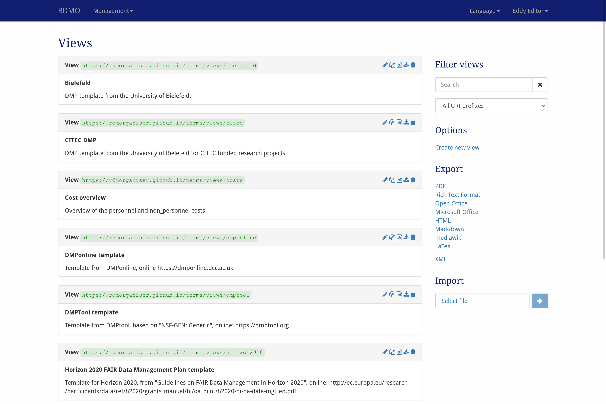
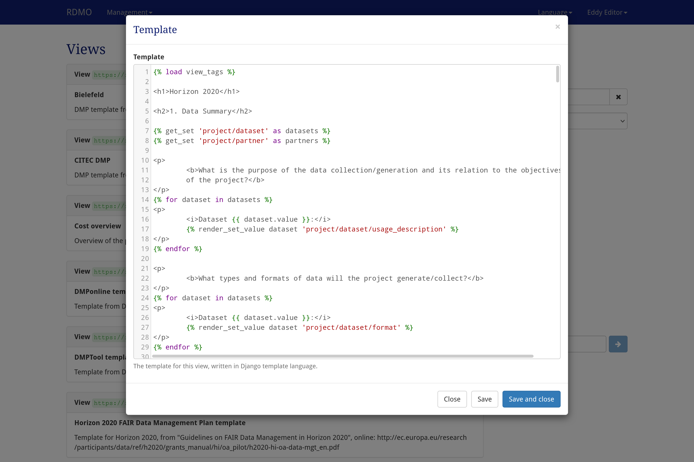

# Views

<!--- mdtoc: toc begin -->

1.	[View configuration](#view-configuration)
	1.	[Syntax overview](#syntax-overview)		
	2.	[Parameters](#parameters)
2.	[Template syntax](#template-syntax)
	1.	[Calculations](#calculations)
	2.	[RDMO-specific tags and filters](#rdmo-specific-tags-and-filters)
	3.	[Child projects](#child-projects)<!--- mdtoc: toc end -->

## View configuration

Views can be configured under *Views* in the management menu in the navigation bar.



> *Screenshot of the views management interface*

On the left-hand side is the main display of all the views available in this installation of RDMO. Views show their key, title and description. On the right side of each views panel, icons indicate ways to interact the element. The following options are available:

-	**Update** () a view to change its properties.
-   **Copy** () a view. This will open a modal to set a new key.
-	**Edit the template** () of a view.
-   **Export** () a view as XML.
-	**Delete** () a view. **This action cannot be undone!**

The sidebar on the right shows additional interface items:

-	**Filter** filters the view according to a user given string or a given URI prefix.
-	**Options** offers additional operations:
	-	Create a new view
-	**Export** exports the conditions to one of the displayed formats. While the textual formats are mainly for presentation purposes, the XML export can be used to transfer the views to a different installation of RDMO.

Views have different properties to control their behavior. As described in [the introduction](index.html), all elements have an URI prefix, a key, and an internal comment only to be seen by other managers of the RDMO installation. In addition, you can edit the parameters below:

### Parameters

| Parameter       | Explanation                                                                                                                              |
| --------------- | ---------------------------------------------------------------------------------------------------------------------------------------- |
| Title           | The title for the view. The title will be shown in the projects overview.                                                                |
| Help            | The help text for the view. The help text will be shown in the projects overview                                                         |
| Groups          | Displays the groups for this view. If at least one group is selected, only users of these<br> groups will see this view for a project.   |
| Sites           | *(Only in a multi site installation)* Displays the sites for this view. Only users of these<br> groups will see this view for a project. |

## Template syntax



> *Screenshot of the template model*

### Syntax overview

Each view has a template, which determines how the answers given by the user are mapped to a textual document. The template is composed using the [Django template](https://docs.djangoproject.com/en/stable/ref/templates/language/) syntax, which is a combination of regular HTML, variables, which get replaced with values when the template is evaluated (`{{ a_variable }}`), and tags, which control the logic of the template (``).

In the first line of the view template you will find the load command for the available view tags. It makes the logic of the template available and should always be there.

```django

```

Immediately afterwards there will probably be variable declarations which load sets into place holders and make them available throughout the whole template. These variables can for example be used in for loops as you will see later.

```django


```

Consider an attribute `project/research_question/title` and a user, who answered the question connected to this attribute with "To boldly go where no man has gone before.". The attribute would be available in the template as `project/research_question/title`.

```django
The main research question of the project is:

```

would, when evaluated in the context by a user in his/her project, render:

```django
The main research question of the project is:
To boldly go where no man has gone before.
```

Lists of multiple values can also be rendered.

```django
<p>
    
</p>
```

As equivalent for the snippet above you can also use the following which gives you more control over the list layout.

```django
<ul>

    
        <li>{{ value.value }}</li>
    
</ul>
```

For set entities, you can use the initially declared variables. Your code would look like this.

```django

    <p>
        
    </p>

```

Values can be used if they meet certain conditions. If you want to display something based on a certain value being `true` you can for example do this. Note that there is an `.is_false` function as well which can be used just as the mentioned counterpart.

```django


    This will be only rendered if personal_data resolves to be true.

```

Or checking a value within a dataset.

```django

    
    
        
    

```

### Calculations

You can do calculations in RDMO's view templates by using filters. The package RDMO utilizes is called [django-mathfilters](https://pypi.org/project/django-mathfilters). The following operations are supported. For more information please have a look into the django mathfilters documentation which can be found at the link mentioned before.

| Filter Name | Operation                |
|-------------|--------------------------|
| sub         | subtraction              |
| mul         | multiplication           |
| div         | division                 |
| intdiv      | integer (floor) division |
| abs         | absolute value           |
| mod         | modulo                   |
| addition    | addition                 |

The following examples illustrate how to use the mathfilters. It is quite easy if you pay attention to two things. First step is to load the desired value into a variable. This can be achieved as usual by `get_value`. Afterwards this value can be used in calculations but it explicitly needs to be used `as_number`.

For example you could do the following to get the sum of two values.

```django



{{ val1.as_number | addition:val2.as_number  }}
```

Note that filters can be piped after another as often as you like. You could easily do something like this. But pay attention to having the piped filters in a single line because Django templates do not support having filters spreading across multiple lines.

```django





{{ val1.as_number | addition:val2.as_number | addition:val3.as_number | addition:val4.as_number }}
```

Please consult the documentation of the Django template syntax for all the available tags and filters: https://docs.djangoproject.com/en/stable/ref/templates/language.

### Details on RDMO-specific tags and filters

The main method to access user data in the templates is the `` tag. It can be used to get all values for an attribute from a project. The `set_prefix`, `set_index`, and `index` arguments can be used to restrict the query further:

* the `index` determines the list position of a value if a question was marked `is_collection`.
* the `set_index` determines the set of a value if a questionset was marked `is_collection`.
* the `set_prefix` determines the superior sets of a value for questionsets in questionsets which are marked `is_collection`. Multiple nested sets are possible and have the form `set_prefix='0|1'`, e.g. for the second set in the first set.

```django

-> get all values for this attribute as variable values.


-> get only the first value (for all sets).


-> get the all values for the first set.


-> get the first value for the first set.


-> get the all values for the first set_prefix (for nested questionsets).
```

As explained above, the `` tag is used to get the values in numerical form to do computations. The form is the same:

```django





```

The following shortcuts exist to obtain single values for a project: `` is the same as `` and `` is the same as ``.

To interact with sets of values the following tags exist:

```django

-> gets the first value for each set




-> get the values for a specific set
```

`` is a shortcut similiar to ``.

The following tags can be used to obtain the `set_prefixes` or `set_indexes` for an attribute:

```django


```

Conditions can be evaluated using the `` tag:

```django

-> check the condition with all values


-> check the conditions only with the values from the first set


-> check the conditions only with values with the set_prefix=0
```

#### Render values

```django
 like  but renders the value in html
 like  but renders a list
 like  but renders an inline list
 like  but renders the value in html
 like  but renders a list
 like  but renders an inline list
```

#### Filters

```django
{{ value|is_true }} returns true if the value is set and not 'no' or something similar
{{ value|is_false }} returns true if the value is set and 'no' or something similar
{{ value|is_empty }} returns true if the value is not set
{{ value|is_not_empty }} returns true if the value is set
```

### Child projects

If child projects exist, they can be accessed using `project.children` (direct childs) and `project.descendants` (all descendants, e.g. childs of childs, etc.). The `project` keyword argument in the view tags are then used to select a particular project, e.g.:

```django

    <div>
    
    </div>



    <div>
    
    </div>

```

## Metadata in exported documents

RDMO's views can be exported as pdf documents or in other office compatible formats. These files are generated using Pandoc and can contain metadata. Pandoc is able to save metadata into exported documents. A mechanism RDMO can make use of.

It is possible to add a metadata header to views, which is characterized by a surrounding `metadata` tag in angle brackets as probably known from html. Inside these brackets a set of json data can be declared holding the metadata information.

An example of a metadata header would be something like this.

```html
<metadata>
{
    "title": "this is a very nice title",
    "author": ["author one", "author two"],
    "keywords": ["nothing", "something", "whatever"]
}
</metadata>
```

The json data are passed unmodified to Pandoc. Therefore is is important to make sure the data have a structure that Pandoc can make sense of. A more elaborated description of which tags are supported can be found in the [Pandoc manual](https://pandoc.org/MANUAL.html#metadata-blocks).

Pandoc does support saving metadata from version 2.3 upwards. Make sure to meet this requirement. If a lower version of Pandoc is installed RDMO won't export any metadata into the generated documents.
